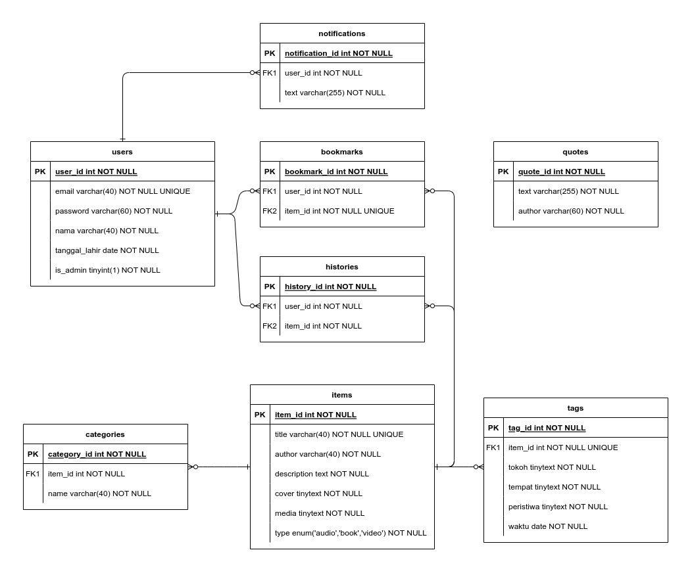

<div align=center>
  <h1>jracademy-api</h1>
  <p><strong>API untuk aplikasi Yayasan Jalan Rahmat. Dibangun dengan <a href="https://expressjs.com/">Express</a>, <a href="https://sequelize.org/">Sequelize</a> dan MySQL/MariaDB.</strong></p>
</div>

## Instalasi

1. Clone repository ini
```sh
git clone https://github.com/sglkc/jracademy-api.git
cd jracademy-api
```

2. Install package dengan npm
```sh
npm install
```

3. Copy `.env.example` ke `.env` dan ubah isinya bila perlu
4. Nyalakan MySQL
5. Buat database untuk aplikasi dan lakukan migrasi schema
```sh
npm run db:create
npm run db:migrate
```

6. Isi database dengan seed (opsional)
```sh
npm run db:seed
```

## Penggunaan

Jalankan dengan npm, lalu coba endpoint menggunakan aplikasi Postman dengan dokumentasi dibawah
```sh
npm start
```

## Dokumentasi

Untuk melihat seluruh endpoint dengan request beserta response dalam API ini, dapat dilihat di link berikut:
[https://documenter.getpostman.com/view/20300240/2s83tJHWWa](https://documenter.getpostman.com/view/20300240/2s83tJHWWa)

## Entity Relationship Diagram

Gambar dibawah ini menjelaskan kolom-kolom yang ada pada setiap tabel dan juga relasinya antar tabel lainnya.



## Lisensi

API ini bukan untuk kegunaan publik
